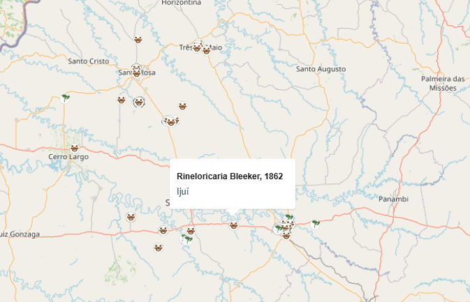
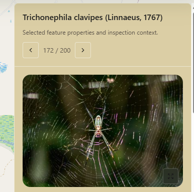
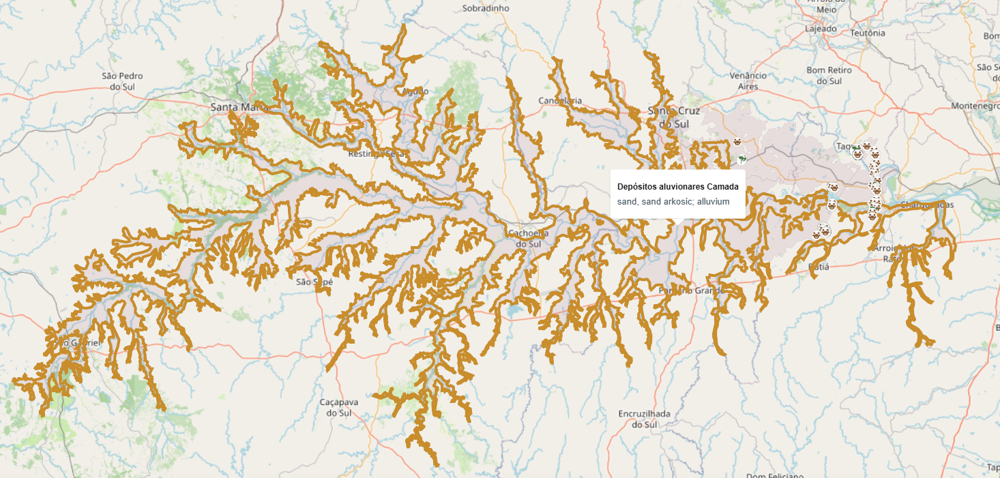
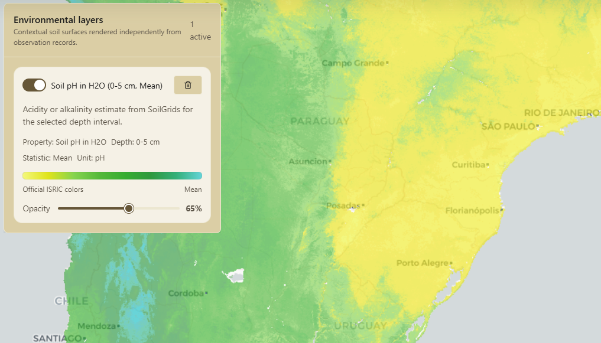

# BGSR

## Biodiversity and Geoscience Spatial Registry

_Map the living world and the ground beneath it._

BGSR is an open-source, map-first scientific platform for exploring biodiversity and geoscience in the same spatial context. It brings together fauna, flora, soil, and geological information in a single interface built for regional analysis, field-oriented research, and environmental interpretation.

<!--

  

-->

## Visual Overview

The current interface is built around a map-first workflow where biodiversity records, geological context, and environmental layers can be explored in the same session.

### Example 1: Area Query With Biodiversity Records

This example shows a bounding box selection followed by occurrence plotting on the map. BGSR can return fauna and flora records together, keeping them directly visible in the spatial context where the query was made.

### Example 2: Occurrence Inspection

Each plotted occurrence can be inspected individually. The inspector emphasizes the scientific identity of the record and, when available from the source, also surfaces media such as observation images for faster interpretation.

### Example 3: Geological Overlay From Macrostrat

BGSR can also render geological information from Macrostrat in the same workspace. In this example, an alluvial deposit unit is displayed as a spatial geology layer, helping connect biodiversity observations with mapped geological structure.

### Example 4: Environmental Layer Visualization

Environmental layers can be explored at broader regional scales. This example shows a large-scale view over southern Brazil and neighboring areas with a SoilGrids pH(H2O) layer enabled, illustrating how BGSR supports environmental interpretation beyond single occurrences.

## Why BGSR

Most spatial tools separate biological records from environmental and geological context. BGSR is designed to connect them.

With BGSR, a single region can be explored through:

- biodiversity occurrences
- fauna and flora differentiation
- soil property layers
- geological unit overlays
- contextual inspection panels
- exportable, enriched spatial results

This makes the application useful not only for seeing what exists in a place, but also for understanding the ecological and geological setting around those records.

## What The Platform Does

BGSR is centered on an interactive map experience where different scientific sources can be queried, visualized, and compared together.

### Biodiversity Exploration

BGSR can query occurrence data for a selected area and display biological records directly on the map. Results can be separated into fauna and flora, inspected individually, and reviewed in a dedicated side panel.

When source records include richer media, BGSR can surface additional detail such as images and taxonomic context to make inspection more informative and visually useful.

### Soil Context

BGSR integrates soil data through environmental layers that can be turned on, compared, and inspected spatially. This allows users to move beyond biological presence alone and understand the soil conditions associated with a region or observation area.

The result is a workflow where biodiversity and environmental context can be read together instead of in isolation.

### Geological Context

BGSR also adds geological context to the same workspace, allowing users to see regional geology overlays alongside biological and soil information.

This makes it possible to evaluate how geological structure, mapped units, and environmental patterns relate to biodiversity records in the same area of interest.

### Unified Spatial Workflow

The main value of BGSR is not just access to multiple sources, but the ability to work with them simultaneously.

Users can:

- query a region once and compare multiple source types
- inspect occurrences and contextual layers without leaving the map
- combine biological, soil, and geological views in the same session
- export enriched results that preserve cross-source spatial context

## Data Sources

BGSR currently works as a connector-driven spatial platform built around open scientific data sources.

| Source                                                     | Role in BGSR                                                                      |
| ---------------------------------------------------------- | --------------------------------------------------------------------------------- |
| [GBIF](https://www.gbif.org/)                              | Biodiversity occurrences, occurrence detail, and biological inspection workflows  |
| [ISRIC SoilGrids](https://www.isric.org/explore/soilgrids) | Soil property layers, contextual environmental analysis, and point-based sampling |
| [Macrostrat](https://macrostrat.org/)                      | Geological units and regional geoscience context                                  |

Some sources are visible directly in the map workflow, while others support enriched inspection and export behavior behind the scenes.

## Design Foundation

BGSR uses [boulder-ui](https://github.com/Gkuran/boulder-ui) as the design system foundation for its interface layer, helping keep the platform visually consistent, operationally clear, and reusable as the workspace grows.

## Current Focus

BGSR is currently focused on:

- biodiversity occurrence exploration
- soil layer visualization
- regional geology overlays
- multi-source map inspection
- enriched data export

The broader direction is to evolve this into a stronger spatial research and fieldwork platform where biological, environmental, and geological evidence can be interpreted together.

## Repository Scope

This repository contains the frontend application for BGSR.

It represents the map experience, interaction model, connector-facing workflows, and scientific inspection interface of the platform.
